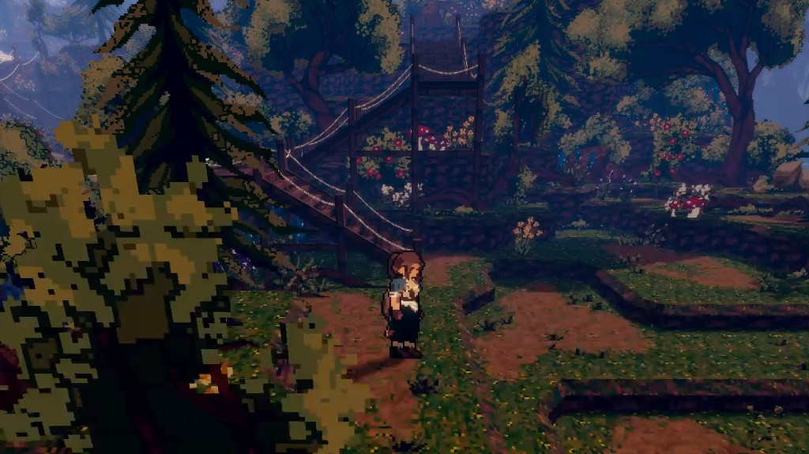
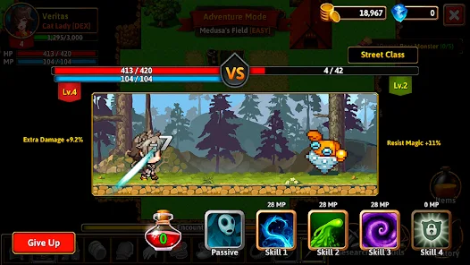
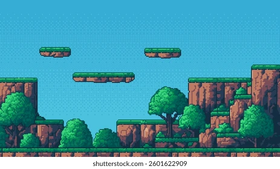
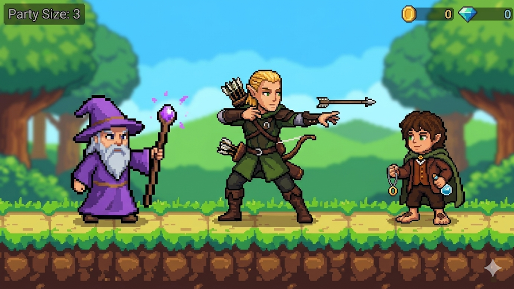

# AI Development Diary

This log documents the AI-assisted development workflow for the Vanilla JS Videogame project.

## AI Tools & Workflow

### 1. Grok (Creative Direction & Lore)
- **Role**: Designing the storyline, characters, enemies, and game structure.
- **Why**: Provided superior, highly detailed narrative answers during initial concepts.

### 2. Gemini (Visuals & Assets)
- **Role**: Generating concept art, images, and graphics.
- **Why**: Selected for its advanced image-creation capabilities.

### 3. Antigravity (Coding & Execution)
- **Role**: Writing, debugging, and implementing the Vanilla JS + Canvas API code.
- **Why**: Direct workspace access for code development and execution.

---

## Architecture Decision Log

### 2026-05-25 — Switched from DOM rendering to Canvas API

**Context:** Initial version built game entities as positioned HTML `div` elements styled with CSS. While functional for physics, the visual output was generic colored boxes — not matching the retro pixel-art design specification.

**Decision:** After re-reading the project rules, **Canvas API is explicitly in the Allowed list**. The game renderer was pivoted to use `<canvas>` + `ctx.getContext('2d')` for all in-game drawing.

**Impact on files:**
- `index.html` → `<canvas id="game-canvas">` replaces the `#game-world` div
- `js/entities.js` → Entities lose DOM elements; gain a `draw(ctx, cameraX)` method
- `js/game.js` → Main render loop calls `ctx.clearRect()` then draws all entities per frame
- `style.css` → Only styles HTML UI overlays now (menus, HUD, screens)

**Why this is better:** Canvas allows drawing the Hobbit with curly hair, a green cloak, sword slash arcs, and glowing effects — matching the Frodo-style design sheet. CSS divs cannot achieve this level of visual fidelity.

### 2026-05-26 — Scoped game to a single highly-polished level (Mordor) and hero (Hobbit)

**Context:** The initial plan proposed a 4-level journey with 3 distinct character classes (Hobbit, Ranger, Wizard). However, implementing the full set of animations, distinct attack types (magic, archery, melee), and assets for all characters and levels would dilute the quality and visual polish of the game given the generative AI sprite limits and complexity.

**Decision:** Scoped the project to focus entirely on **Level 1: Mordor Wasteland** and the **Hobbit** hero. This allowed us to channel AI assets and rendering pipelines into creating a stunning boss encounter (Eye of Sauron) with meteor rains, laser beams, flying Nazgûl dive-attacks, custom retro synthesized audio effects, screen shakes, and custom transparent pixel-art platform tiling.

**Impact:** The result is a highly polished, premium, and fully completed 2D side-scrolling level with rich aesthetics and zero placeholder graphics, rather than a wide but sparse MVP.

---

## AI Failure Log

*This section will log occurrences where an AI provided incorrect or broken code, requiring manual intervention.*

### Entry 1: 2026-05-26 - Programmatic Hobbit looked cartoonish/mushroom-like
**What I asked the AI:** Recreate the Hobbit character using Canvas drawing functions.
**What it gave me:** A draw method using basic circles (`ctx.arc`) and ovals (`ctx.ellipse`).
**What was wrong:** The visual output was too simple, smooth, and looked like a basic vector mushroom instead of retro 16-bit pixel art.
**How I fixed it:** Pivoted to generating a detailed sprite sheet, cropping the frames, removing the background, and rendering them via `ctx.drawImage` in Base64 data format.
**Time lost:** ~25 minutes

### Entry 2: 2026-05-26 - Headless Chrome DOM dump missed base64 value
**What I asked the AI:** Extract the base64 sprite sheet string from the DOM after rendering.
**What it gave me:** A script setting `textarea.value = base64` and taking the DOM dump.
**What was wrong:** DOM dump in Chrome headless only prints the serializable HTML, which doesn't include the dynamically updated value property of textareas.
**How I fixed it:** Updated the script to set `textarea.textContent = base64` which writes it directly to the DOM HTML tree.
**Time lost:** ~10 minutes

### Entry 3: 2026-05-26 - Regex extracted the wrong base64 image URL
**What I asked the AI:** Parse `dom_output.txt` and extract the base64 data URL.
**What it gave me:** A simple `/data:image\/png;base64,.../` regex.
**What was wrong:** It matched the first base64 image in the document, which was the original large white-background sprite sheet, instead of the cropped transparent one inside the textarea.
**How I fixed it:** Targeted the regex specifically inside the textarea tag: `/<textarea id="base64-output">([^<]+)<\/textarea>/.`
**Time lost:** ~15 minutes

### Entry 4: 2026-05-26 - Headless screenshot captured empty sprites on load
**What I asked the AI:** Render the canvas and take a screenshot of the Hobbit poses.
**What it gave me:** A script that drew the player immediately on load.
**What was wrong:** `new Image()` with a base64 source is still loaded asynchronously by the browser, resulting in blank/invisible sprites when screenshotted immediately.
**How I fixed it:** Wrapped the rendering logic in the `onload` handler of the sprite sheet image to guarantee it is complete before taking the screenshot.
**Time lost:** ~12 minutes

### Entry 5: 2026-05-26 - Sound effect timing lag
**What I asked the AI:** Implement synthesized retro sounds for walking and running.
**What it gave me:** Triggering a walking sound every frame the player velocity was non-zero.
**What was wrong:** Playing sound every frame created a high-frequency buzz/noise because too many sounds played simultaneously.
**How I fixed it:** Added a step timer (`stepTimer = 22` frames) to throttle footsteps to play only every ~360ms while running.
**Time lost:** ~8 minutes

### Entry 6: 2026-05-26 - Platforms were too high to navigate during Boss Stuns
**What I asked the AI:** Create a challenging, vertical platform layout for the Mordor level.
**What it gave me:** Platforms positioned at heights `y = 140` to `y = 270` (vertical jump differences of up to 140 pixels).
**What was wrong:** The Hobbit's maximum jump height is 134 pixels, making a 140px jump physically impossible. Additionally, the Boss's shockwave inflicts a "Fear" effect that reduces jump height to 62 pixels, making even 80px jumps impossible during battle.
**How I fixed it:** Rebalanced the platform heights, capping the vertical gaps between adjacent platforms to under 40 pixels. This ensured all jumps are easily cleared under all states while maintaining vertical multi-tier options.
**Time lost:** ~15 minutes

### Entry 7: 2026-05-26 - Programmatic canvas rectangles looked generic and blocky
**What I asked the AI:** Draw detailed pixel art platforms programmatically.
**What it gave me:** Basic canvas `fillRect` and lines to draw planks and stone layers.
**What was wrong:** The resulting drawing was too flat, looking like basic solid grey and brown rectangles instead of hand-crafted pixel art.
**How I fixed it:** Created a Python generator using Pillow to build 64x24 stone and 80x28 wood PNG sprites using the exact pixel colors and highlights. Converted them to Base64 transparent images and implemented horizontal 3-slice tiling in `Platform.draw()` with layered, craggy rock island bottoms.
**Time lost:** ~20 minutes

### Entry 8: 2026-05-26 - Image-to-Text limitations caused generic blocky character sprites
**What I asked the AI:** Recreate the Hobbit character matching the color design and details of the provided reference image.
**What it gave me:** A very simple, generic character consisting of a square and a rectangle moving on the screen.
**What was wrong:** The AI struggled with an image-to-text translation bottleneck: it could not extract fine-grained, exact pixel coordinates and color codes from the visual image description to draw it programmatically. Prompting with more details only yielded slightly better but still unrecognizable blocks.
**How I fixed it:** Used Grok to analyze the reference image and programmatically map out the exact pixel coordinates and RGB colors (pixel blueprint). Provided this coordinate map to the coding AI to draw the character frame-by-frame. This technique was repeated for enemies and other assets, avoiding the need to purchase online assets (though my teammate used a pre-made asset for the main character).
**Time lost:** ~150 minutes (but this method saved many more hours in asset creation)

## The images we got:

# The first referance image:

## The image create by Gemini for game:

## We have planned to make a game 3 caracters but becous of complexity we decided to make a game with only 1 character:
- Re-indexed the level configuration from Level 4 to Level 1 in `js/levels.js`, `js/game.js`, `js/main.js`, and `index.html`, which properly updates the HUD to show `LEVEL: 1` during gameplay.
- Refactored the `Player` class in `js/entities.js` to strictly contain the Hobbit's dimensions (`24x36`) and base stats, removing unused stubs and switch cases for Ranger and Wizard heroes.
- Cleaned up the character selection card on the start screen (`index.html`) to show only the Hobbit hero card, aligning the user interface with the codebase scope.
- Aligned `README.md` and `AI_DIARY.md` descriptions to ensure all mentions of level indexing and playable characters are consistent throughout.
