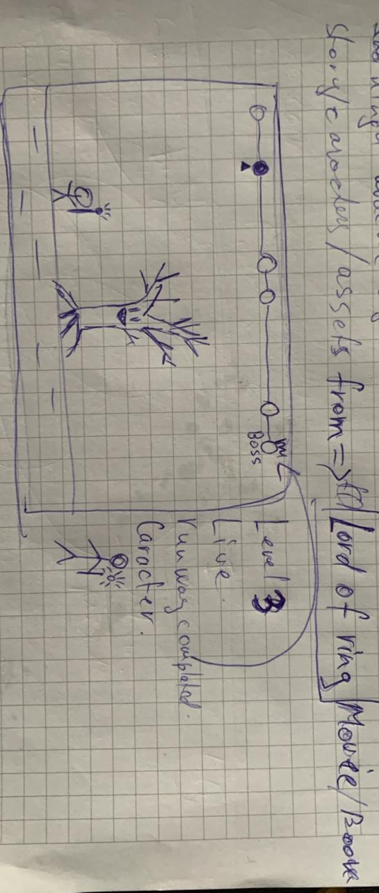
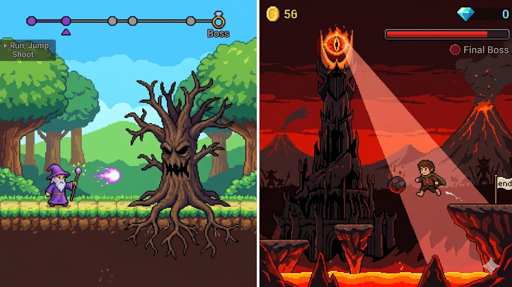

# AI Development Diary

This log documents the AI-assisted development workflow for the Vanilla JS Videogame project.

## AI Tools & Workflow

### 1. Grok (Creative Direction & Lore)
- **Role**: Designing the storyline, characters, enemies, and game structure.
- **Why**: Provided superior, highly detailed narrative answers during initial concepts.

### 2. Gemini (Visuals & Assets)
- **Role**: Generating concept art, images, and graphics.
- **Why**: Selected for its advanced image-creation capabilities.

### 3. Antigravity (Coding & Execution)
- **Role**: Writing, debugging, and implementing the Vanilla JS + Canvas API code.
- **Why**: Direct workspace access for code development and execution.

---

## Architecture Decision Log

### 2026-05-25 — Switched from DOM rendering to Canvas API

**Context:** Initial version built game entities as positioned HTML `div` elements styled with CSS. While functional for physics, the visual output was generic colored boxes — not matching the retro pixel-art design specification.

**Decision:** After re-reading the project rules, **Canvas API is explicitly in the Allowed list**. The game renderer was pivoted to use `<canvas>` + `ctx.getContext('2d')` for all in-game drawing.

**Impact on files:**
- `index.html` → `<canvas id="game-canvas">` replaces the `#game-world` div
- `js/entities.js` → Entities lose DOM elements; gain a `draw(ctx, cameraX)` method
- `js/game.js` → Main render loop calls `ctx.clearRect()` then draws all entities per frame
- `style.css` → Only styles HTML UI overlays now (menus, HUD, screens)

**Why this is better:** Canvas allows drawing the Hobbit with curly hair, a green cloak, sword slash arcs, and glowing effects — matching the Frodo-style design sheet. CSS divs cannot achieve this level of visual fidelity.

---

## AI Failure Log

*This section will log occurrences where an AI provided incorrect or broken code, requiring manual intervention.*

## The images we got:

# The first referance image:

